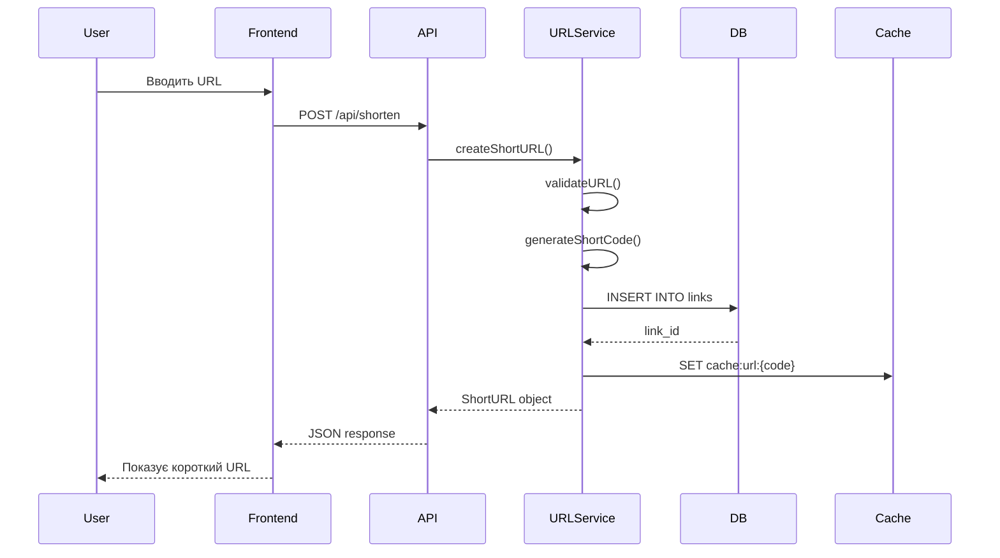
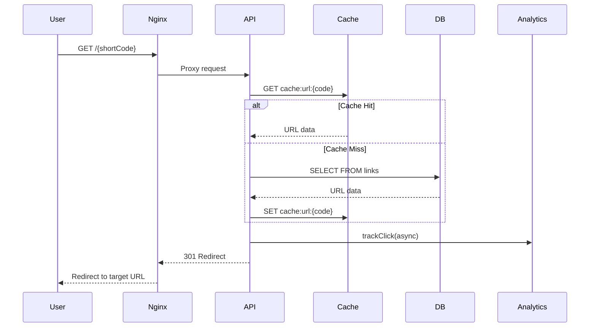
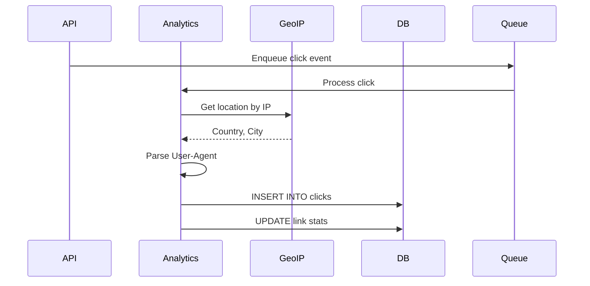

# Архітектура системи MVP

## 1. Загальна архітектура

### Архітектурний підхід
Для MVP обрано **монолітну архітектуру** з можливістю подальшої міграції на мікросервіси.

### Основні компоненти

```
┌─────────────────────────────────────────────────────────────┐
│                         Client Layer                        │
├──────────────────────┬──────────────────────────────────────┤
│   Web Browser        │         Mobile Browser               │
└──────────┬───────────┴──────────────┬───────────────────────┘
           │                          │
           ▼                          ▼
┌─────────────────────────────────────────────────────────────┐
│                     Load Balancer (Nginx)                   │
└──────────────────────────┬──────────────────────────────────┘
                           │
                           ▼
┌─────────────────────────────────────────────────────────────┐
│                    Application Server                       │
├─────────────────────────────────────────────────────────────┤
│  ┌─────────────────┐  ┌─────────────────┐                 │
│  │   Web App       │  │    API Server   │                 │
│  │   (React)       │  │   (Express.js)  │                 │
│  └─────────────────┘  └─────────────────┘                 │
│                                                             │
│  ┌──────────────────────────────────────┐                 │
│  │         Business Logic Layer         │                 │
│  ├──────────────────────────────────────┤                 │
│  │ • URL Service                        │                 │
│  │ • Analytics Service                  │                 │
│  │ • Auth Service                       │                 │
│  │ • User Service                       │                 │
│  └──────────────────────────────────────┘                 │
└─────────────────────────┬───────────────────────────────────┘
                          │
        ┌─────────────────┼─────────────────┐
        ▼                 ▼                 ▼
┌───────────────┐ ┌───────────────┐ ┌───────────────┐
│  PostgreSQL   │ │     Redis     │ │   GeoIP DB    │
│   (Primary)   │ │    (Cache)    │ │  (MaxMind)    │
└───────────────┘ └───────────────┘ └───────────────┘
```

## 2. Компоненти системи

### 2.1 Frontend (Client Layer)

#### Web Application
- **Технологія**: React 18 + TypeScript
- **Routing**: React Router v6
- **State Management**: Context API + useReducer
- **UI Framework**: Tailwind CSS
- **HTTP Client**: Axios

#### Основні сторінки
1. **Landing Page** (`/`)
   - Форма скорочення URL
   - Демонстрація функціоналу
   
2. **Dashboard** (`/dashboard`)
   - Список посилань користувача
   - Фільтрація та пошук
   
3. **Analytics** (`/analytics/:shortCode`)
   - Графіки та статистика
   - Таблиця кліків
   
4. **Auth Pages** (`/login`, `/register`)
   - Форми авторизації
   - Відновлення паролю

### 2.2 Backend (Application Server)

#### API Server
- **Framework**: Express.js 4.x
- **Runtime**: Node.js 20 LTS
- **Validation**: Joi
- **ORM**: Prisma

#### Модулі бізнес-логіки

##### URL Service
```javascript
class URLService {
  - generateShortCode(): string
  - createShortURL(originalURL: string, userId?: number): ShortURL
  - getURLByCode(shortCode: string): ShortURL
  - validateURL(url: string): boolean
  - incrementClickCount(shortCode: string): void
}
```

##### Analytics Service
```javascript
class AnalyticsService {
  - trackClick(shortCode: string, request: Request): ClickEvent
  - getAnalytics(shortCode: string, period: string): Analytics
  - getGeolocation(ip: string): GeoData
  - aggregateStats(shortCode: string): AggregatedStats
}
```

##### Auth Service
```javascript
class AuthService {
  - register(email: string, password: string): User
  - login(email: string, password: string): TokenPair
  - refreshToken(refreshToken: string): TokenPair
  - validateToken(token: string): UserPayload
  - resetPassword(email: string): void
}
```

### 2.3 Data Layer

#### PostgreSQL (Primary Database)
- Основне сховище даних
- ACID транзакції
- Індекси для оптимізації

#### Redis (Cache & Sessions)
- Кешування популярних посилань
- Зберігання сесій
- Rate limiting counters
- TTL: 1 година для URL cache

#### GeoIP Database
- MaxMind GeoLite2 Country
- Оновлення щотижня
- Fallback на IP2Location

## 3. Потоки даних

### 3.1 Створення короткого посилання



### 3.2 Процес редиректу



### 3.3 Збір аналітики



## 4. Масштабування

### Горизонтальне масштабування

#### Phase 1 (MVP) - Single Server
- 1 VPS (4 CPU, 8GB RAM)
- Всі компоненти на одному сервері
- Підтримка до 1000 req/sec

#### Phase 2 - Separation
- Окремий сервер для БД
- Окремий сервер для додатку
- Load balancer

#### Phase 3 - Microservices
- URL Service як окремий сервіс
- Analytics Service окремо
- API Gateway
- Message Queue (RabbitMQ)

### Вертикальне масштабування
- Збільшення RAM для Redis cache
- Збільшення CPU для обробки редиректів
- SSD для швидшого доступу до БД

## 5. Моніторинг та логування

### Метрики для моніторингу
- **Application metrics**
  - Requests per second
  - Response time (p50, p95, p99)
  - Error rate
  - Active users
  
- **System metrics**
  - CPU usage
  - Memory usage
  - Disk I/O
  - Network I/O

### Логування
- **Application logs**: Winston
- **Access logs**: Nginx
- **Error tracking**: Sentry
- **Log aggregation**: ELK Stack (Phase 2)

### Health Checks
- `/health` - базова перевірка
- `/health/db` - перевірка БД
- `/health/redis` - перевірка Redis
- `/health/ready` - готовність прийому трафіку

## 6. Резервне копіювання та відновлення

### Backup стратегія
- **Database**: Daily automated backups
- **Redis**: Snapshot кожні 6 годин
- **Зберігання**: 7 днів локально, 30 днів в S3

### Disaster Recovery
- RPO (Recovery Point Objective): 24 години
- RTO (Recovery Time Objective): 4 години
- Документований процес відновлення

## 7. Оптимізації

### Кешування
- URL metadata: 1 година в Redis
- Popular URLs: pre-warm cache
- Static assets: CDN (Cloudflare)

### Database оптимізації
- Індекси на `short_code`, `user_id`
- Партиціонування таблиці `clicks` по даті
- Connection pooling

### Frontend оптимізації
- Code splitting
- Lazy loading
- Service Worker для offline mode
- Compression (gzip/brotli)